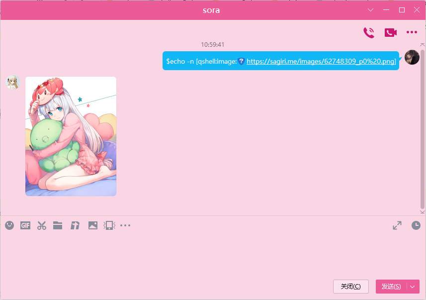

在qq代理执行系统Shell命令
每次执行一条命令都会启动一个进程（不会保留变量环境  
不能执行堵塞的命令  

## 如何使用
从Releases下载jar文件放到mirai-console的plugins  
关于如何安装mirai-console看这里[Mirai - UserManual](https://github.com/mamoe/mirai/blob/dev/docs/UserManual.md)
启动mcl会在config/QShell/生成配置文件

## 配置文件
master 主人的qq,主人有执行所有命令的权限  
shellList 是一个列表，每一条代表着一个shell配置  
通常使用 /qs add (shellNmae) (regex) [notPresenMessage] 生成配置
```
/**
 * 命令解析器配置
 * @param name 名字
 * @param commandList 命令行，第一个是可执行程序，后面的是参数
 * @param commandRegex 匹配qq消息的正则表达式 第X个分组会替换命令行的$X,X是正整数
 * @param replace 执行前替换执行的命令的 是一个字符串 左边是替换的字符串用;隔开右是替换的字符串
 * @param trustList 能执行命令的用户 * 代表所有人， u[qq]代表qq用户， f[qq]代表qq好友， g[q群号码]qq群
 * @param blackList 黑名单
 * @param isEnabled 是否启用
 * @param description 说明
 * @param notPresentMessage 没有权限的提示,这个字符串长度小于1时不提示
 * @param message  里面的 $msg 会被替换从标准（错误）输出
 * @param timeout 超时时间
 */
@Serializable
data class ShellConfig(
    var name : String,
    var commandRegex : String,
    var replace : MutableList<String>,
    val commandList: MutableList<String>,
    val trustList : MutableList<String>,
    val blackList : MutableList<String>,
    var isEnabled : Boolean,
    var description : String,
    var notPresentMessage : String,
    var message : String,
    var timeout : Long
    )
```

## Master 在QQ执行QShell指令
QShell每次启动都会把Master添加到权限系统  
配合 [chat-command](https://github.com/project-mirai/chat-command) 
Master 可以在qq上执行Qshell命令  


## 配置
### 默认的配置
只在Linux有效
```
# 主人qq号
master: 2476255563
# shell列表
shellList: 
  - name: shell
    commandRegex: '^\$(.+)'
    replace: []
    commandList: 
      - bash
      - '-c'
      - '$1'
    trustList: []
    blackList: []
    isEnabled: true
    description: 执行Shell命令
    notPresentMessage: 没有执行Shell的权限
    message: '$msg'
    timeout: 0
```


### Windows Cmd
```
# 主人qq号
master: 2476255563
# shell列表
shellList: 
  - name: shell
    commandRegex: '^\$(.+)'
    replace: []
    commandList: 
      - cmd
      - '/c'
      - '$1'
    trustList: []
    blackList: []
    isEnabled: true
    description: 执行Shell命令
    notPresentMessage: 没有执行Cmd的权限
    message: '$msg'
    timeout: 0
```

### Windows PowerShell
```
# 主人qq号
master: 2476255563
# shell列表
shellList: 
  - name: shell
    commandRegex: '^\$(.+)'
    replace: []
    commandList: 
      - powershell
      - '-Command'
      - '$1'
    trustList: []
    blackList: []
    isEnabled: true
    description: 执行Shell命令
    notPresentMessage: 没有执行PowerShell的权限
    message: '$msg'
    timeout: 0
```

### Python
```
# 主人qq号
master: 2476255563
# shell列表
shellList: 
  - name: shell
    commandRegex: '^\$(.+)'
    replace: []
    commandList: 
      - python
      - '-c'
      - '$1'
    trustList: []
    blackList: []
    isEnabled: true
    description: 执行Shell命令
    notPresentMessage: 没有执行Python的权限
    message: '$msg'
    timeout: 0
```

### 在容器中运行bash
确保当前有权限执行docker命令
并且容器shell在运行  
运行一个容器,守护进程方式，并且执行bash,不让ta退出  
docker container run -d -it --rm --name=shell archlinux /bin/bash  
不要用bash去执行docker（很容易被提权,直接使用docker  

```
# 主人qq号
master: 2476255563
# shell列表
shellList: 
  - name: shell
    commandRegex: '^\$(.+)'
    replace: []
    commandList: 
      - docker
      - exec
      - shell
      - bash
      - '-c'
      - '$1'
    trustList: []
    blackList: []
    isEnabled: true
    description: 执行Shell命令
    notPresentMessage: 没有执行Shell的权限
    message: '$msg'
    timeout: 0
```

## 输出格式化
标准（错误）输出有些特殊字符串会被格式化  
### qshell image
  
### Mirai码
阅读 [Mirai Core Api Document](https://docs.mirai.mamoe.net/Messages.html#%E8%BD%AC%E4%B9%89%E8%A7%84%E5%88%99)  


## 变量环境
在执行程序之前qshell会添加一些环境变量  
可以在shell下执行env 查看所有环境变量  
### 配置相关
MASTER 和配置文件的master一样  
### 发送者相关
SENDERNAME 发送者的qq昵称  
SENDERID 发送者的qq号  
SENDERSIGN 发送者的qq签名  
SENDEREMAIL 发送者的电子邮箱  
SENDERLEVEL 发送者等级 数字类型  
SENDERAGE 发送者年龄  
SENDERSEX 发送者性别  
### 消息相关
MESSAGECONTENT 消息内容  
MESSAGEMIRAI 消息内容MiraiCode格式
### 机器人相关
BOTNAME 机器人的qq昵称  
BOTAVATARURL 机器人头像的Url地址  
BOTFRIENDSSIZE 机器人的好友数量  
BOTGROUPSSIZE 机器人加入群的数量  
### java相关
JAVAVMNAME java虚拟机名字  
JAVAVERSION java版本  
### 操作系统相关
OSARCH 操作系统架构  
OSNAME 操作系统名字  

## 指令
/qs help 获取帮助  
/qs list 获取shell列表  
/qs info 获取shell详细信息  
/qs echo 回复指定消息  
/qs trust 添加用户到指定信任列表  
/qs deny 从信任列表移除用户  
/qs denyAll 清楚指定的shell所有信任列表  
/qs enable 开启一个shell  
/qs disable 关闭一个shell  
/qs add 添加一个shell  
/qs set 设置shell的指定值  
/qs cmd 编辑命令行  
/qs reload 重新加载配置  
