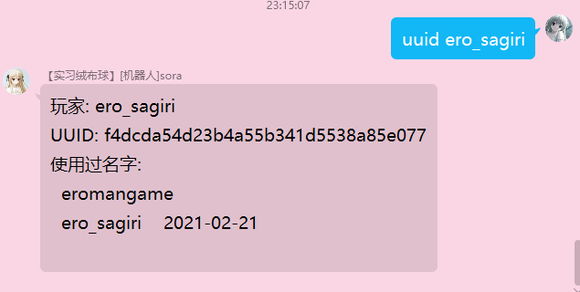

# 获取minecraft玩家的UUID

## 安装
需要安装requests
```shell
pip install requests
```
需要执行权限
```shell
chmod +x uuid.py
```

## 运行测试
```shell
./uuid.py ero_sagiri
```

## 添加到QShell配置文件
```yaml
- name: uuid
    commandRegex: '^uuid\s+(.+)'
    replace: []
    commandList:
      - python
      - '/home/ubuntu/python/uuid.py'
      - '$1'
    trustList:
      - '*'
    blackList: []
    isEnabled: true
    description: description
    notPresentMessage: ''
    message: '$msg'
    timeout: 0
```

## 效果

